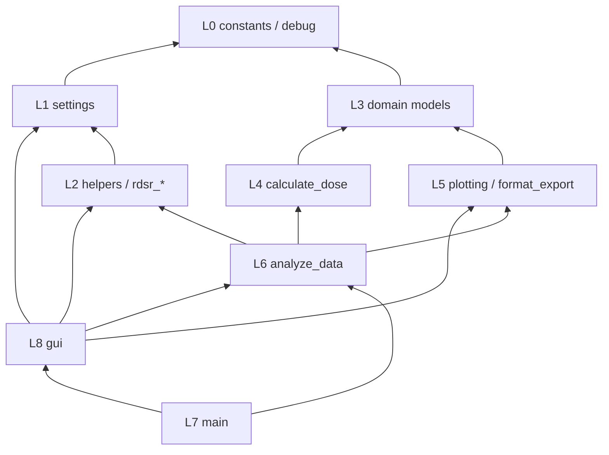

# GUISkinDose — Codebase Overview

> See also: [GUI_PLAN.md](plans/GUI_PLAN.md) | [AGENTS.md](../AGENTS.md)

## What the project does

GUISkinDose estimates **peak skin dose (PSD)** and generates **3D skin dose maps** for fluoroscopic X-ray procedures. It reads a DICOM Radiation Dose Structured Report (RDSR) file or a supported tabular event-table export (`.csv`, `.tsv`, `.xlsx`), reconstructs the 3D geometry of each irradiation event (beam angle, table position, field size, kVp, filtration), places a computational patient phantom in that geometry, and accumulates dose to each skin cell across all events using physics-based correction factors.

It is a fork of the upstream [PySkinDose](https://github.com/rvbCMTS/PySkinDose) project, renamed `guiskindose` to allow independent development.

---

## Repository layout

```
src/guiskindose/          # Main package
  main.py                  # Entry point: main() and CLI dispatch
  __main__.py              # `python -m guiskindose` entry; re-uses get_argument_parser
  cli_args.py              # argparse construction (extracted from main.py); re-exported via main.py
  analyze_data.py          # Core orchestration function
  phantom_class.py         # Phantom (patient / table / pad) model
  beam_class.py            # X-ray beam and detector model
  geom_calc.py             # Geometry calculations
  corrections.py           # Physics correction factors
  db_connect.py            # SQLite correction-factor database
  format_export_data.py    # Output formatting (dict / JSON / HTML)
  dev_data.py              # Hard-coded dev/test parameters
   constants.py             # All string/numeric constants (~200 constants)
  normalization_settings.json  # Per-vendor RDSR normalization rules
  settings_example.json    # Template settings file
  settings/                # Settings dataclasses
  helpers/                 # Utility functions
  plotting/                # All Plotly visualization code
  calculate_dose/          # Dose calculation pipeline
  example_data/RDSR/       # Bundled example DICOM RDSR files
  phantom_data/            # STL mesh files for human phantoms
docs/                      # Sphinx documentation + getting-started notebook
corrections.db             # SQLite database (correction factors, HVL tables)
```

---

## Package layering and dependency rules

GUISkinDose is organized in layers so settings, dose physics, and presentation stay separable. Higher layers orchestrate lower ones; lower layers must not depend on GUI or plotting entry points.

### Layer map

| Layer | Modules | Role |
|-------|---------|------|
| **L0 — Shared** | `constants.py`, `debug.py` | String keys, debug helpers; no business logic |
| **L1 — Settings** | `settings/` | `PyskindoseSettings` and related dataclasses; may use L0, `helpers/` |
| **L2 — Helpers & input** | `helpers/`, `rdsr_parser.py`, `rdsr_normalizer.py` | Parsing, normalization, settings loading |
| **L3 — Domain** | `beam_class.py`, `phantom_class.py`, `geom_calc.py`, `corrections.py`, `db_connect.py` | Geometry, phantoms, beams, correction factors |
| **L4 — Dose pipeline** | `calculate_dose/` | Per-event dose accumulation (uses L3) |
| **L5 — Presentation** | `plotting/`, `format_export_data.py` | Plotly plots and export formatting |
| **L6 — Orchestration** | `analyze_data.py` | Mode dispatch: geometry plots vs dose calculation |
| **L7 — Entry** | `main.py`, `__main__.py`, `cli_args.py` | CLI argparse and public `main()` API |
| **L8 — GUI (optional extra)** | `gui/` | NiceGUI app; uses orchestration and input, not dose internals |

**Multi-exam Geometry (GUI):** `gui/tabs/geometry.py` binds offset sliders to `loaded_exam_meta[active_exam_index]`; `gui/geometry_preview.py` slices `rdsr_df` via `EXAM_INDEX_COLUMN`; composite preview pauses via `procedure_live_preview_paused` above 30 events in any `Full procedure` path (single-exam or multi-exam, composite or not). Calculate/Settings summaries use `gui/summary_formatters.py` and `per_exam_offsets_version` on `AppState`.

**Native GUI window state:** `gui/app.py` and `gui/window_prefs.py` persist native-window geometry in
`~/.guiskindose/gui.json`, falling back to `~/.mypyskindose/gui.json` when the new file is absent.
On macOS, native startup intentionally normalizes a saved
`"maximized": true` state into a safe titled window sized to the screen's visible desktop area,
then persists `maximized=False`; Windows/Linux continue to replay the native maximized flag.



### Enforced rules (CI)

Structural tests in `tests/unittests/test_architecture_layers.py` assert:

1. **`settings/` independence** — must not import dose, plotting, GUI, orchestration, or RDSR runtime modules (may use `constants`, `helpers`, `debug`, and other `settings` submodules).
2. **`gui/` → `calculate_dose/`** — GUI must not import the dose pipeline directly; use `analyze_data` (orchestration) instead.
3. **`calculate_dose/` isolation** — must not import `gui/` or `plotting/` (presentation stays above dose math).

These match current imports. We use pytest AST checks rather than `import-linter` to avoid an extra dev dependency; add `import-linter` later if contracts grow.

### Known exceptions (documented, not enforced)

- `phantom_class.py` imports `plotting.create_ploty_ijk_indices` for mesh index helpers — legacy coupling; refactor in a future cleanup PR if mesh utilities move to `helpers/`.

---

## End-to-end data flow

```
RDSR .dcm file
      │
      ▼
rdsr_parser.py          — extracts raw irradiation events from DICOM tags
      │
      ▼
rdsr_normalizer.py      — normalises units, applies vendor-specific offsets
      │                   (normalization_settings.json)
      ▼
analyze_data.py         — creates Phantom objects, dispatches to mode handler
      │
      ├─► create_geometry_plot.py   (modes: plot_setup / plot_event / plot_procedure)
      │
      └─► calculate_dose/           (mode: calculate_dose)
              │
              ├─ position_patient_phantom_on_table()   (geom_calc.py)
              ├─ apply_below_floor_kvp_policy()        (geom_calc.py — snap/skip/manual/exam_average)
              ├─ fetch_and_append_hvl()                (geom_calc.py + corrections.db)
              ├─ calculate_k_bs()                      (corrections.py)
              ├─ calculate_k_tab()                     (corrections.py)
              └─ calculate_irradiation_event_result()  (iterative, per-event)
                      │
                      ├─ Beam.check_hit()              (beam_class.py)
                      ├─ scale_field_area()            (geom_calc.py)
                      ├─ k_isq, k_bs, k_med, k_tab    (corrections.py)
                      └─ accumulate dose → dose_map
                              │
                              ▼
                    format_export_data.py  →  dict / JSON / HTML output
```

---

## Entry points

### `main()` — `src/guiskindose/main.py`

The primary callable for all use cases.

```python
from guiskindose.main import main
output = main(file_path="path/to/file.dcm", settings=settings)
```

| Parameter | Type | Description |
|-----------|------|-------------|
| `file_path` | `str \| Path \| list \| None` | Path to RDSR `.dcm`, pre-parsed `.json`, or tabular export (`.csv`, `.tsv`, `.xlsx`). Pass a list of paths for multi-exam mode. |
| `settings` | `str \| dict \| PyskindoseSettings` | Settings (JSON string, dict, or settings object) |

Returns the output dict/JSON when `output_format` is `"dict"` or `"json"`, otherwise `None` (plots are rendered inline or saved to file).

### `analyze_input_file()` — `main.py` (public API)

The primary public function exported from `guiskindose`. Accepts a file path (RDSR, JSON, or tabular), a settings object, and optional schema/export parameters. Prefer this over `main()` in library usage.

### `analyze_normalized_data_with_custom_settings_object()` — `main.py`

For headless use when you already have a normalised `pd.DataFrame`.

### CLI

```bash
python -m guiskindose --mode headless --file-path path/to/file.dcm --settings path/to/settings.json
python -m guiskindose --mode gui          # launch GUI
```

Key flags (see `python -m guiskindose --help` for the full list):

| Flag | Purpose |
|------|---------|
| `--mode` / `-m` | `headless` (default) or `gui` |
| `--file-path` / `-f` | One or more input files (`.dcm`, `.csv`, `.tsv`, `.xlsx`) |
| `--settings` / `-s` | Path to settings JSON file |
| `--input-schema` | Tabular schema: `auto`, `normalized`, `generic_rdsr_like`, `radimetrics`, `dosetrack` |
| `--sheet-name` | Sheet name or 0-based index for Excel inputs |
| `--input-preview-only` | Print a value-safe input summary without running dose calculation |
| `--aggregate` | In multi-exam mode: print only the aggregate PSD |
| `--export-format` | Generate a rich audit report: `xlsx`, `pdf`, `html`, or `docx` |
| `--export-path` | Required output path when `--export-format` is set |
| `--force` | Allow overwriting an existing untracked export file |
| `--export-title` | Optional report title |
| `--include-source-identifiers` | Include source filenames in reports (may contain PHI) |
| `--allow-ignored-checkout-output` | Allow export to a gitignored path inside the checkout |
| `--kerma-meter-correction` | Enable kerma-meter correction factors |
| `--kerma-meter-correction-file` | Path to CF lookup table (CSV/TSV/XLSX/JSON) |
| `--kerma-meter-correction-mode` | CF resolution mode: `file` or `prompt` (GUI-only) |
| `--kerma-meter-explicit-label` | Force all events to this equipment label for CF lookup |
| `--native` | Open GUI in a native desktop window (requires `[gui-native]` extra) |
| `--host` | GUI server bind address (`127.0.0.1` applied when the flag is unset; argparse default is `None`; requires `--allow-network` for non-loopback) |
| `--allow-network` | Acknowledge non-loopback GUI binding |

---

## Settings

### Loading settings

```python
from guiskindose import load_settings_example_json, PyskindoseSettings

settings = PyskindoseSettings(settings=load_settings_example_json())
```

Settings can be passed as a JSON file path, a JSON string, a plain dict, or a `PyskindoseSettings` object.

### `PyskindoseSettings` — `settings/pyskindose_settings.py`

Top-level settings object. Key attributes:

| Attribute | Type | Default | Description |
|-----------|------|---------|-------------|
| `mode` | `str` | `"plot_event"` | Run mode (see below) |
| `rdsr_filename` | `str` | — | RDSR filename (used when no `file_path` passed to `main()`) |
| `estimate_k_tab` | `bool` | `True` | Use estimated table attenuation instead of measured |
| `k_tab_val` | `float` | `0.8` | Table transmission factor (0–1) when estimating |
| `inherent_filtration` | `float` | `3.1` | X-ray tube inherent filtration in mmAl |
| `remove_invalid_rows` | `bool` | `False` | Drop events with kVp = 0 |
| `below_floor_kvp_policy` | `str` | `"exam_average"` | Handle events with kVp < 25 kV HVL floor: `snap`/`skip`/`manual`/`exam_average` |
| `below_floor_kvp_manual` | `float` | `70.0` | Substituted kVp when `below_floor_kvp_policy="manual"` (example value; code fallback is the 25.0 HVL floor) |
| `silence_pydicom_warnings` | `bool` | `True` | Suppress pydicom warnings |
| `output_format` | `str` | `"html"` | `"html"`, `"dict"`, or `"json"` |
| `corrections_db_path` | `str` | `"corrections.db"` | Path to SQLite corrections database |
| `phantom` | `PhantomSettings` | — | Phantom sub-settings |
| `plot` | `Plotsettings` | — | Plot sub-settings |
| `normalization_settings` | `NormalizationSettings` | — | Vendor normalization sub-settings |

### Run modes

| Mode | Description |
|------|-------------|
| `"plot_setup"` | Render phantom + table in starting position, no RDSR needed |
| `"plot_event"` | Render geometry for one specific irradiation event |
| `"plot_procedure"` | Interactive slider through all events in the RDSR |
| `"calculate_dose"` | Full dose calculation + optional dose map plot |

### `PhantomSettings` — `settings/phantom_settings.py`

| Attribute | Type | Description |
|-----------|------|-------------|
| `model` | `str` | `"plane"`, `"cylinder"`, or `"human"` |
| `human_mesh` | `str` | STL filename without extension (e.g. `"hudfrid"`) |
| `patient_orientation` | `str` | `"head_first_supine"` or `"feet_first_supine"` |
| `patient_offset.d_lon` | `float` | Longitudinal offset from table isocenter (cm) |
| `patient_offset.d_ver` | `float` | Vertical offset (cm) |
| `patient_offset.d_lat` | `float` | Lateral offset (cm) |
| `dimension` | `PhantomDimensions` | Sizes for plane/cylinder/table/pad |

### `PhantomDimensions` — `settings/phantom_dimensions.py`

All values in cm:

| Key | Default | Description |
|-----|---------|-------------|
| `plane_length` | 120 | Plane phantom length |
| `plane_width` | 40 | Plane phantom width |
| `plane_resolution` | `"sparse"` | `"sparse"` or `"dense"` |
| `cylinder_length` | 150 | Cylinder phantom length |
| `cylinder_radii_a` | 20 | Cylinder semi-axis (width direction) |
| `cylinder_radii_b` | 10 | Cylinder semi-axis (thickness direction) |
| `cylinder_resolution` | `"sparse"` | `"sparse"` or `"dense"` |
| `table_length` | 281.5 | Support table length |
| `table_width` | 45 | Support table width |
| `table_thickness` | 5 | Support table thickness |
| `pad_length` | 281.5 | Pad length |
| `pad_width` | 45 | Pad width |
| `pad_thickness` | 4 | Pad thickness |

### `Plotsettings` — `settings/plot_settings.py`

| Attribute | Default | Description |
|-----------|---------|-------------|
| `interactivity` | `True` | Interactive HTML plot vs. static image |
| `dark_mode` | `True` | Dark background |
| `notebook_mode` | `False` | Optimise sizing for Jupyter output cells |
| `plot_dosemap` | `True` | Show dose map after `calculate_dose` |
| `max_events_for_patient_inclusion` | `10` | Hide patient in `plot_procedure` above this event count |
| `plot_event_index` | `0` | Which event to show in `plot_event` mode |

Defaults above are the code fallbacks applied when keys are absent (`settings/plot_settings.py`); `settings_example.json` is a dev template and intentionally differs (`notebook_mode: true`, `plot_dosemap: false`, `max_events_for_patient_inclusion: 0`, `plot_event_index: 1`).

---

## Core classes

### `Phantom` — `phantom_class.py`

Represents the patient, table, or pad as a mesh of skin cells.

**Valid models:** `"plane"`, `"cylinder"`, `"human"`, `"table"`, `"pad"`

Key attributes:

| Attribute | Description |
|-----------|-------------|
| `r` | `(n, 3)` array of skin cell XYZ coordinates |
| `n` | `(n, 3)` normal vectors (cylinder and human only) |
| `dose` | `(n,)` accumulated dose per skin cell |
| `ijk` | Vertex indices for Plotly Mesh3D rendering |
| `r_ref` | Reference position after initial placement |
| `table_length` | Needed for correct rotation origin |

Key methods: `rotate()`, `translate()`, `save_position()`, `position()`

Human phantoms are loaded from STL files in `phantom_data/`. The catalog is large (46 full stems — 23 base clinical + 23 `*_arms_down` twins — plus 92 reduced previews; 138 `.stl` files) and is **discovered at runtime** — use `print_available_human_phantoms()` or the GUI mesh selector for the authoritative list. Family groupings include:

- **Adult standard:** `adult_ecto_*`, `adult_endo_*` (male/female)
- **Adult bariatric:** `adult_bariatric_{male,female}_{1,2,3}` and `*_arms_down` variants
- **Pediatric:** `ped_preschool_*`, `ped_5y_*`, `ped_10y_*`
- **Senior:** `senior_{male,female}`
- **Legacy/compat:** `hudfrid`, `adult_male`, `adult_female`, `junior_male`, `junior_female`
- **Resolution variants:** `*_reduced_1000t` (speed), `*_reduced_3000t` (GUI preview)

See [FEATURE_INVENTORY.md §2.2](FEATURE_INVENTORY.md) for the complete family table and alias list.

### `Beam` — `beam_class.py`

Represents the X-ray beam as a pyramid (apex = source, base = detector plane).

Key attributes:

| Attribute | Description |
|-----------|-------------|
| `r` | `(5, 3)` — source apex + 4 detector corners |
| `det_r` | `(8, 3)` — 8 corners of the cuboid detector |
| `N` | `(4, 3)` — normal vectors to the 4 beam faces |

Key method: `check_hit(phantom)` — returns a per-cell boolean mask (`list[bool]`) marking entrance skin cells inside the beam pyramid.

Beam angulation parameters from RDSR:
- `Ap1` — primary positioner angle (LAT rotation, about Z)
- `Ap2` — secondary positioner angle (LON rotation, about X)
- `Ap3` — detector rotation (VERT, about Y)

---

## Dose calculation pipeline

### `calculate_dose/calculate_dose.py`

Orchestrates the full calculation:
1. Creates patient `Phantom` and positions it on the table
2. Fetches HVL values from `corrections.db`
3. Detects geometry changes between events (`check_new_geometry`)
4. Pre-computes backscatter interpolation objects for all events
5. Computes table transmission correction
6. Calls `calculate_irradiation_event_result()` in a loop over each event

Geometry-change handling and per-event dose accumulation live in
`calculate_dose/perform_calculations_for_new_geometries.py` and
`calculate_dose/add_correction_and_event_dose_to_output.py`.

### `calculate_dose/calculate_irradiation_event_result.py`

Per-event processing:
1. Creates `Beam` for the event
2. Calls `Beam.check_hit()` to find irradiated skin cells
3. Scales field area to each skin cell
4. Applies corrections: k_isq × k_bs × k_med × k_tab
5. Adds corrected dose to `dose_map`
6. Iterates over the remaining events in a loop (former tail recursion replaced; see `plans/archive/recursion-to-iteration.md`)

### Correction factors — `corrections.py`

| Factor | Function | Physics |
|--------|----------|---------|
| `k_isq` | `calculate_k_isq()` | Inverse-square-law: `(d_ref / d_skin)²` |
| `k_bs` | `calculate_k_bs()` | Backscatter (Benmakhlouf et al., field size + kVp) |
| `k_med` | `calculate_k_med()` | Medium correction (air kerma → tissue dose) |
| `k_tab` | `calculate_k_tab()` | Table/pad attenuation (measured or estimated; (kVp, Cu) interpolation + edge clamping, fail-soft to 1.0 for unknown device/plane) |
| `k_meter` | `kerma_correction.resolve_correction_factors()` | Kerma-meter CF (optional; reported K_IRP × CF before physics corrections; fail-soft to `default_factor`) |

---

## RDSR normalisation

### `rdsr_parser.py`

Extracts raw irradiation event data from DICOM RDSR tags into a `pd.DataFrame`.

### `rdsr_normalizer.py`

Normalises the parsed data to a consistent coordinate system. Applies vendor-specific rules from `normalization_settings.json`:

| Vendor | Model | Field size mode | Notes |
|--------|-------|-----------------|-------|
| Siemens | AXIOM-Artis | `CFA` (collimated field area) | No translation offset |
| Philips | Allura Clarity | `ASD` (actual shutter distance) | Has translation offset |

Normalised DataFrame columns include: `Ap1`, `Ap2`, `Ap3` (beam angles), `At1`, `At2`, `At3` (table angles), `Tx`, `Ty`, `Tz` (table translations), `DSD`, `DSI`, `DID`, `DSIRP` (distances), `kVp`, `K_IRP` (air kerma at IRP), filter thicknesses.

---

## Geometry calculations — `geom_calc.py`

| Function | Description |
|----------|-------------|
| `position_patient_phantom_on_table()` | Places phantom on table with offset and orientation |
| `calculate_field_size()` | Scales field size from detector plane to skin |
| `scale_field_area()` | Field area at each skin cell |
| `check_new_geometry()` | Detects geometry changes between events |
| `check_table_hits()` | Ray-triangle intersection: does beam pass through table? |
| `fetch_and_append_hvl()` | HVL from database by kVp + filtration; 2-D bilinear interpolation over (kVp, Cu) per (inherent, Al) slice, clamped at grid edges |

---

## Database — `db_connect.py` + `corrections.db`

SQLite database with tables:
- `hvl_combined` — HVL values by kVp and filtration
- `correction_medium_and_backscatter` — k_med and k_bs tabulated values
- `correction_table_and_pad_attenuation` — measured k_tab values
- `device_info` — device-specific metadata

Auto-created from CSV files on first run if the `.db` file is missing.

---

## Output — `format_export_data.py`

When `output_format` is `"dict"` or `"json"`, `main()` returns a structured object with:

| Key | Description |
|-----|-------------|
| `psd` | Peak skin dose (mGy) — `max(dose_map)` |
| `air_kerma` | Sum of reported (uncorrected) per-event K_IRP |
| `air_kerma_corrected` | Sum of kerma-meter-corrected K_IRP (equals `air_kerma` when CF disabled) |
| `dose_map` | Sparse list of `(cell_index, dose)` tuples |
| `patient` | Phantom geometry (skin cell positions, vertex indices, reference position) |
| `table` | Table phantom geometry |
| `pad` | Pad phantom geometry |
| `events` | Per-event beam/table geometry (rotations, translations, distances) |
| `corrections` | Per-event correction factors (k_isq, k_bs, k_med, k_tab) |

---

## Helpers — `helpers/`

| File | Function |
|------|----------|
| `calculate_rotation_matrices.py` | Converts At1/At2/At3 table angles to 3×3 rotation matrices |
| `read_and_normalize_rdsr_data.py` | Loads RDSR (DICOM or JSON), parses, normalises |
| `parse_settings_to_settings_class.py` | Converts JSON/dict to `PyskindoseSettings` |
| `create_attributes_string.py` | Generates formatted attribute strings for `print_parameters()` |

---

## Plotting — `plotting/`

All visualisation uses [Plotly](https://plotly.com/python/) for interactive 3D rendering.

| File | Purpose |
|------|---------|
| `create_geometry_plot.py` | Dispatcher: routes to setup/event/procedure plot |
| `plot_setup.py` | Renders phantom + table in zero-angle starting position |
| `plot_event.py` | Renders geometry for one event |
| `plot_procedure.py` | Renders all events with a slider control |
| `create_dose_map_plot.py` | Renders the 3D dose map on the phantom |
| `create_mesh3d.py` | Builds Plotly `Mesh3d` traces |
| `create_wireframes.py` | Beam and detector wireframe traces |
| `create_plot_and_save_to_file.py` | Saves plots as HTML or PNG |
| `get_camera_view.py` | Camera presets (AP, LAT, etc.) |
| `plot_settings.py` | Plot-level color/size/margin fetchers |
| `plot_layout.py` | Shared Plotly `go.Layout` builders for geometry, procedure, and dose-map plots |

Smaller builders not listed per-row: `plot_geometry.py`, `create_setup_and_event_plot.py`, `create_irradiation_event_procedure_plot_data.py`, `create_layout_for_dose_map_plots.py`, `create_geometry_plot_texts.py`, `create_notebook_dose_map_plot.py`, `get_visual_offset.py`.

---

## Public API helpers — `__init__.py`

```python
from guiskindose import (
    load_settings_example_json,       # → dict
    print_available_human_phantoms,   # prints STL names
    get_path_to_example_rdsr_files,   # → Path
    print_example_rdsr_files,         # prints .dcm filenames
    PyskindoseSettings,
)
```

---

## Dependencies

### Core (always installed)

| Package | Purpose |
|---------|---------|
| `numpy` | Array math |
| `pandas` | RDSR data as DataFrame |
| `scipy` | Cubic spline interpolation for corrections |
| `pydicom` | DICOM RDSR parsing |
| `numpy-stl` | STL mesh loading for human phantoms |
| `openpyxl` | Tabular `.xlsx` input reading |
| `plotly` | Interactive 3D visualisation |
| `tqdm` | Progress bar during dose calculation |
| `rich` | Coloured terminal output for `print_parameters()` |
| `kaleido` | Static image export from Plotly |
| `pillow` | Image handling |
| `psutil` | System resource monitoring |
| `pypdf` | PDF parsing for privacy admission (sensitive-content scan) |
| `reportlab>=4.0` | PDF rich audit report export |
| `python-docx>=1.1` | DOCX rich audit report export |

### Optional extras

| Extra | Package(s) | Purpose |
|-------|------------|---------|
| `[export]` | — (no-op alias) | Retained so existing `pip install guiskindose[export]` commands keep working; the report backends above are core dependencies |
| `[gui]` | `nicegui>=2.0.0` | Browser-based GUI |
| `[gui-native]` | `nicegui>=2.0.0`, `pywebview` | Native desktop window GUI |
| `[dev]` | ruff, pytest, basedpyright, bandit, etc. | Development tooling |
| `[docs]` | Sphinx and extensions | Documentation build |
| `[notebooks]` | JupyterLab | Getting-started notebook |
